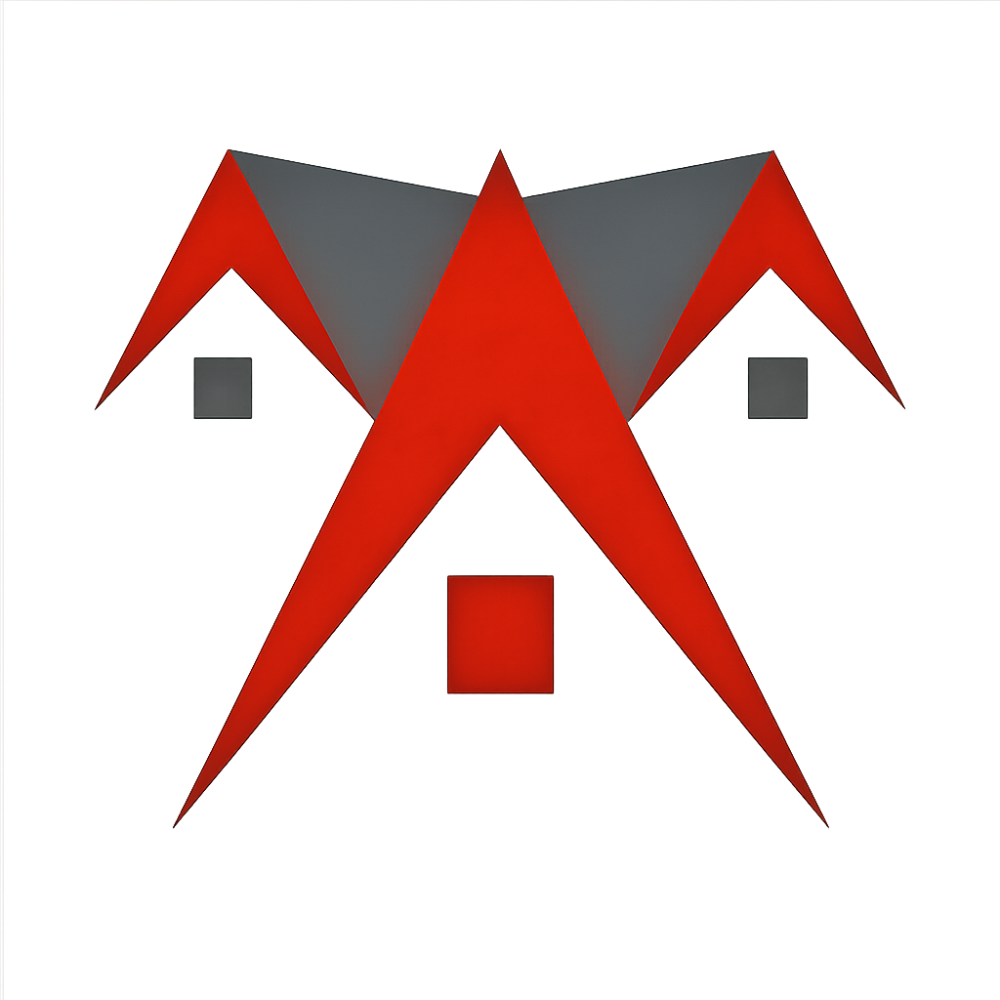

<div align="center">


<br />
<br />

# Ndukego Investment & Properties Ltd

### Enterprise Real Estate Platform — Nigeria

*Trusted · Transparent · Professional*

<br />


<br />

**[🌐 Public Website](https://ndukegoltd.com)** &nbsp;·&nbsp;
**[🔒 Admin Portal](https://ndukego-investment-props-ltd-admin.vercel.app)** &nbsp;·&nbsp;
**[📧 Contact](mailto:ndukegoinvest.propertiesltd@gmail.com)**

</div>

---

## Overview

This repository is the full-stack monorepo for **Ndukego Investment & Properties Ltd** — a Nigerian real estate and investment group. The platform covers everything from public property listings and estate discovery to staff operations, reservations, customer management, and document tracking.

Built with a modern, production-grade architecture: **Next.js** for both the public site and admin portal, **NestJS** for the REST API, **Prisma** with **PostgreSQL** for data, and **Turborepo** to wire it all together.

---

## Platform Capabilities

| Area | What it does |
|------|-------------|
| 🏡 **Property Listings** | Full catalogue with rich media galleries, filters, search, and property detail pages |
| 🏘️ **Estate Management** | Estates with phases, blocks, infrastructure tracking, and plot availability |
| 📋 **Reservations** | Customer reservation requests with installment plan support |
| 💼 **Admin Portal** | Role-based staff portal for managing properties, customers, reservations, and documents |
| 🔐 **Authentication** | JWT access/refresh tokens · TOTP-secured super-admin access |
| 📄 **Document Management** | Secure storage for property titles, survey plans, purchase agreements, and more |
| 📈 **Full Audit Trail** | Every create, update, approval, and access action is logged |
| 💬 **Inquiries** | Customer inquiry capture with agent contact integration |
| 📊 **Insights** | Market analysis and investment guides for prospective clients |

---

## Monorepo Structure

```
ndukego-investment-props/
│
├── apps/
│   ├── web/          # Public-facing website (Next.js 15, App Router)
│   ├── admin/        # Staff operations portal (Next.js 15, App Router)
│   └── api/          # REST API backend (NestJS 10)
│
└── packages/
    ├── database/     # Prisma schema, migrations, and generated client
    ├── assets/       # Shared brand assets — logo components
    ├── lib/          # Shared utility functions
    ├── types/        # Shared TypeScript types
    └── ui/           # Shared shadcn/ui component primitives
```

---

## Applications

### 🌐 `apps/web` — Public Website
The customer-facing platform. Browse properties and estates, read market insights, make inquiries, and submit reservations. Built with Next.js App Router, Fraunces + DM Sans typography, and Tailwind CSS. Deployed on **Vercel**.

### 🔒 `apps/admin` — Staff Admin Portal
Internal operations portal for the Ndukego team. Manage the full property lifecycle (Draft → Inspection → Approval → Published → Reserved → Sold), handle customer records, process reservations, upload documents, and view audit logs. Access is role-based; super-admin entry uses TOTP authentication. Deployed on **Vercel**.

### ⚙️ `apps/api` — Backend API
NestJS REST API serving both apps. Handles authentication, property and estate CRUD, media uploads, reservation workflows, customer management, document storage, audit logging, and more. Deployed on **Railway**.

---

## Tech Stack

| Layer | Technology |
|-------|-----------|
| **Frontend** | Next.js 15 (App Router) · React 19 · TypeScript |
| **Styling** | Tailwind CSS · shadcn/ui · Fraunces · DM Sans |
| **Backend** | NestJS 10 · TypeScript · Passport.js |
| **Database** | PostgreSQL · Prisma ORM |
| **Auth** | JWT (access + refresh) · otplib TOTP |
| **Monorepo** | Turborepo · pnpm workspaces |
| **Deployment** | Vercel (web + admin) · Railway (API + DB) |
| **Analytics** | Vercel Speed Insights |

---

## Getting Started

### Prerequisites

- **Node.js** ≥ 20
- **pnpm** ≥ 9 — `npm install -g pnpm`
- **PostgreSQL** running locally (or a Railway connection string)

### Installation

```sh
# Clone the repository
git clone https://github.com/TacitusDave/ndukego-ltd.git
cd ndukego-ltd

# Install all dependencies across the monorepo
pnpm install
```

### Environment Variables

Copy the example env files and fill in your values:

```sh
cp apps/api/.env.example     apps/api/.env
cp apps/web/.env.example     apps/web/.env.local
cp apps/admin/.env.example   apps/admin/.env.local
```

Key variables to configure:

| Variable | App | Description |
|----------|-----|-------------|
| `DATABASE_URL` | api | PostgreSQL connection string |
| `JWT_SECRET` | api | Secret for signing JWT tokens |
| `JWT_REFRESH_SECRET` | api | Secret for refresh tokens |
| `SUPER_ADMIN_TOTP_SECRET` | api | TOTP base32 secret for super-admin login |
| `NEXT_PUBLIC_API_URL` | web, admin | API base URL (`/api/v1`) |

### Database Setup

```sh
# Run Prisma migrations
cd apps/api
pnpm prisma migrate dev

# (Optional) Seed initial data
pnpm prisma db seed
```

### Run in Development

```sh
# From the repo root — starts all three apps simultaneously
pnpm dev
```

| App | Local URL |
|-----|-----------|
| Public Website | http://localhost:3000 |
| Admin Portal | http://localhost:3001 |
| API | http://localhost:4000 |

---

## Deployment

| App | Platform | Branch |
|-----|----------|--------|
| `apps/web` | [Vercel](https://vercel.com) | `main` |
| `apps/admin` | [Vercel](https://vercel.com) | `main` |
| `apps/api` | [Railway](https://railway.app) | `main` |

Every push to `main` triggers an automatic redeploy on both platforms.

---

## Contact

**Ndukego Investment & Properties Ltd**

| | |
|--|--|
| 🌐 Website | [ndukegoltd.com](https://ndukegoltd.com) |
| 📧 Email | [ndukegoinvest.propertiesltd@gmail.com](mailto:ndukegoinvest.propertiesltd@gmail.com) |
| 📞 Phone | +234 803 609 6700 |
| 📍 Address | 758 Independence Ave, Central Business District, Abuja, Nigeria |
| 📸 Instagram | [@ndukego.ltd](https://www.instagram.com/ndukego.ltd) |

---

<div align="center">



<br />

*© 2025 Ndukego Investment & Properties Limited. All rights reserved.*

</div>
